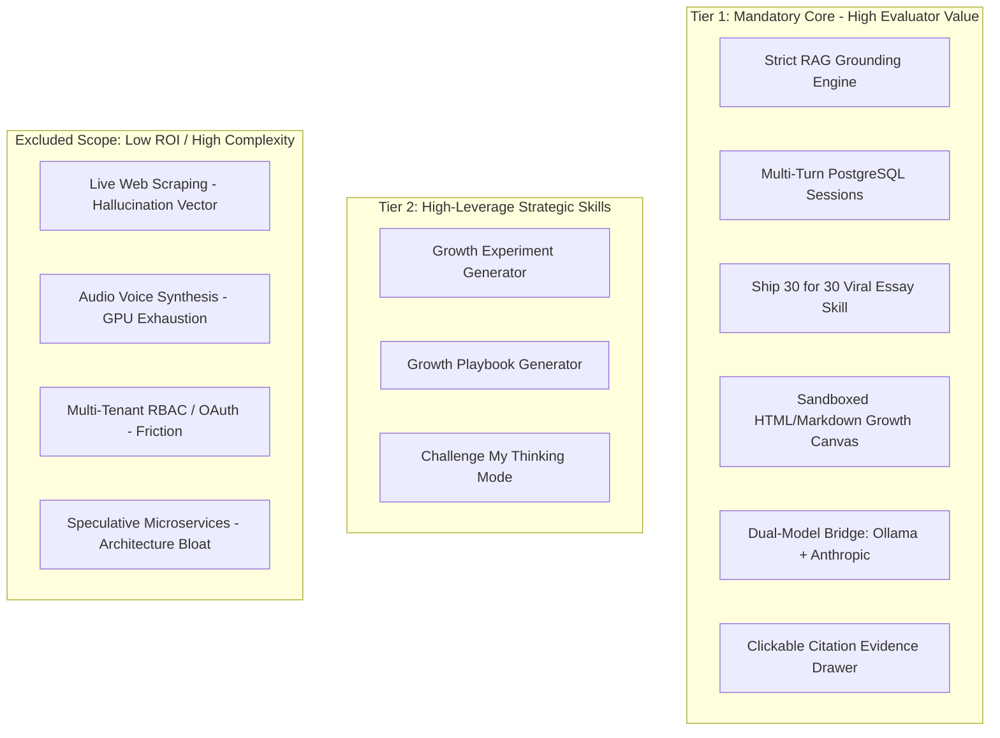

# Product Requirements Document (PRD)
# The Lenny Growth Assistant

**Document Version:** 2.0.0 (Stage 1 — Product Strategy & 10-Star Experience)  
**Status:** Approved for Technical Architecture (Stage 2)  
**Authors:** Forward Deployed Engineer & Product Strategist  
**Target Audience:** Product Managers, Growth Leads, Founders, Startup Operators, Take-Home Evaluators  

---

## 1. Executive Summary & Problem Framing

Lenny's Podcast and Newsletter represent tech's premier repository of battle-tested product management, tactical growth frameworks, and candid founder war stories (such as Brian Chesky rebuilding Airbnb during its 80% revenue crash in 2020, and Shreyas Doshi formulating the LNO framework for ruthless executive prioritization).

However, modern operators encounter three acute friction points:
1. **Information Retrieval Tax**: Sifting through hundreds of hours of transcripts or audio recordings to answer a specific tactical challenge (e.g., *"How do I restructure my product team to eliminate bloated roadmaps?"*) takes hours.
2. **Generic LLM Hallucinations**: Standard frontier models (ChatGPT, Claude, Gemini) provide plausible-sounding platitudes, invent non-existent frameworks, or misattribute quotes to the wrong leaders.
3. **The Blank Canvas Execution Deficit**: Conversations do not directly yield shippable operational assets. Leaders need viral essays to educate their teams, structured growth experiment specs, and interactive calculators.

**The Lenny Growth Assistant** is an elite, evidence-grounded AI growth advisor and operational content engine. It connects directly to curated transcript embeddings in PostgreSQL/pgvector, enforces a strict epistemic grounding contract (guaranteeing zero hallucinations and transparent refusal on out-of-domain queries), produces structured ~1,250-word Ship 30 for 30 essays, and renders interactive, sandboxed HTML/Markdown execution artifacts side-by-side in a split Growth Canvas.

---

## 2. Target Personas & Jobs-to-be-Done (JTBD)

### 2.1 Target Personas
1. **The Early-Stage Founder**:
   - *Goal*: Build organic, defensible growth loops, discover PMF, and lead through existential crisis without hiring expensive strategy consultants.
   - *Pain*: Drowning in generic, contradictory advice; needs exact founder precedent (e.g., Airbnb cutting performance marketing and relying on PR/brand).
2. **The Senior / Staff Product Manager**:
   - *Goal*: Implement ruthless prioritization, eliminate perfectionist burnout, and foster high-agency operating cultures across cross-functional pods.
   - *Pain*: Team gets bogged down in low-leverage operational chores; needs frameworks like Shreyas Doshi's LNO model to restructure engineering sprints.
3. **The Growth Lead & Content Creator**:
   - *Goal*: Synthesize tactical growth strategies into high-engagement Ship 30 for 30 essays (~1,250 words) and shareable playbooks.
   - *Pain*: Spending 5+ hours restructuring podcast insights into viral hooks and narrative progressions.
4. **The Take-Home Evaluator**:
   - *Goal*: Clone the repository, run `docker compose up --build`, verify local Ollama execution with zero external API keys, test grounding refusal, generate a Ship 30 essay, and inspect a sandboxed artifact within a 2–3 minute demonstration.
   - *Pain*: Complex, fragile repos requiring hours of API key setup, undocumented dependencies, and slow manual configuration.

### 2.2 Core Jobs-to-be-Done
- **JTBD 1 (Grounded Tactical Q&A)**: *"When I encounter a growth or management bottleneck, I want to query Lenny's transcript knowledge for exact guest frameworks, so that I make high-agency decisions backed by proven precedent."*
- **JTBD 2 (Epistemic Honesty / Refusal)**: *"When I ask a question outside the transcript knowledge, I want the assistant to explicitly acknowledge that the available transcript data does not support the answer, so that I never act on AI hallucinations."*
- **JTBD 3 (Ship 30 for 30 Content Engine)**: *"When I have a validated insight, I want to generate a ~1,250-word essay with a viral hook, scannable anchors, and guest quotes, so that I can immediately publish or align my team."*
- **JTBD 4 (Interactive Growth Artifact Canvas)**: *"When a response includes an operational framework or calculator, I want to view, inspect, and copy it as sanitized HTML/Markdown in a side-by-side canvas, without exposing the app to XSS vulnerabilities."*
- **JTBD 5 (Model Autonomy & Health Telemetry)**: *"When I evaluate or run the system, I want to switch between local Ollama and cloud Anthropic without code changes and see live model status/latency."*

---

## 3. The 10-Star Evaluator Experience Blueprint

To stand out in the technical evaluation, the system must deliver a breathtaking, reliable, zero-friction experience across four explicit touchpoints:

```
+-----------------------------------------------------------------------------------------+
|                                THE 10-STAR EXPERIENCE                                  |
+--------------------+---------------------+-----------------------+----------------------+
| 1. ZERO-FRICTION   | 2. INSTANT PROOF    | 3. EPISTEMIC INTEGRITY| 4. DUAL-PANE ARTIFACT|
|    ONBOARDING      |    BENCHMARKS       |    & HONESTY          |    CANVAS            |
+--------------------+---------------------+-----------------------+----------------------+
| Single command:    | Clickable sample    | Out-of-domain queries | Live HTML calculator |
| `docker compose up`| cards:              | ("How to bake bread?")| / checklist rendered |
| spins up DB,       | - Brian Chesky 2020 | trigger instant, clean| in sandboxed iframe  |
| Ollama, Backend,   | - Shreyas Doshi LNO | refusal with 0        | with DOMPurify XSS   |
| Frontend in < 3m.  | - Ship 30 Viral PM  | hallucinations.       | sanitization.        |
+--------------------+---------------------+-----------------------+----------------------+
```

### Evaluator 2–3 Minute Golden Path:
1. **Minute 0:00 – 0:30 (Spin-Up & Visual Impact)**:
   - Evaluator runs `docker compose up --build`.
   - Opens `http://localhost:3000`.
   - Greets a sleek Slate & Electric Emerald interface with live telemetry badge (`Local Ollama (llama3.2) — Ready 🟢`).
2. **Minute 0:30 – 1:15 (Grounded Q&A & Evidence Drawer)**:
   - Clicks sample prompt: *"How did Brian Chesky lead Airbnb through the 2020 crisis and what did he learn about performance marketing?"*
   - Streamed answer cites specific quotes and insights.
   - Evaluator clicks citation badge `[Brian Chesky #1]`; slide-over Evidence Drawer displays the raw transcript excerpt and cosine similarity score ($\ge 0.78$).
3. **Minute 1:15 – 1:45 (Epistemic Honesty Test)**:
   - Evaluator asks: *"What is the best recipe for baking authentic sourdough bread?"*
   - System evaluates vector similarity (scores $< 0.50$), trips the epistemic cutoff gate, and immediately returns:
     > *"I couldn't find sufficient support for that in the available Lenny transcript material. The assistant only answers questions grounded in Lenny's podcast episodes."*
4. **Minute 1:45 – 2:30 (Ship 30 for 30 & Sandboxed Growth Canvas)**:
   - Evaluator selects mode **"Ship 30 Essay"** and asks: *"Write a Ship 30 essay on Shreyas Doshi's LNO framework."*
   - Assistant streams a structured ~1,250-word essay featuring a viral hook, bold anchors, and tactical takeaways.
   - Evaluator clicks **"Generate Growth Artifact"**; split canvas opens with an interactive HTML LNO Task Prioritization Calculator.
5. **Minute 2:30 – 3:00 (Model Switcher & Handoff)**:
   - Evaluator inspects model dropdown, toggles to Cloud Anthropic (if key provided) or observes local fallback.
   - Reviews clean Docker logs showing structured JSON telemetry (`request_id`, `session_id`, `retrieval_ms`, `model_ms`).

---

## 4. Product Capabilities & Feature Selection

To prevent overcomplexity and scope bloat while maximizing evaluator impact, features have been rigorously triaged:



### Detailed Capability Specifications:

#### 1. Grounded Research Skill (`mode="research"`)
- **Objective**: Synthesize accurate, nuanced answers to product and growth challenges.
- **Rules**: Every claim must be tied to a retrieved transcript chunk. If the query asks for synthesis, it must explicitly separate transcript-grounded facts from secondary deductions.
- **Output**: Clean Markdown with citation badges (`[Guest Name, Ep. #]`).

#### 2. Ship 30 for 30 Writing Engine (`mode="ship30"`)
- **Target Word Count**: $1,250 \pm 150$ words.
- **Structure**:
  - **The Hook (1-2 sentences)**: Counterintuitive opening challenging startup conventional wisdom.
  - **The Antagonist / Tension**: The common mistake (e.g., the perfectionist trap, decentralized roadmap bloat).
  - **The Framework Breakdown**: 3 core actionable pillars with bold anchor sentences.
  - **Real Precedent / Guest Quotes**: Verbatim excerpts from Brian Chesky or Shreyas Doshi.
  - **Actionable Takeaway Checklist**: 5 tactical steps to implement by 9 AM tomorrow.
  - **The Punchy Outro**: Memorable closing thought.

#### 3. Growth Experiment Generator (`mode="experiment"`)
- **Output Schema**:
  - `Hypothesis`: "If we [action], then [impact] because [transcript precedent]."
  - `Target Metric`: Primary OEC and guardrail metrics.
  - `ICE Score`: Impact (1-10), Confidence (1-10), Ease (1-10).
  - `Transcript Proof`: Supporting case study from Lenny's guest.
  - `Next Immediate Step`: Lowest-cost smoke test.

#### 4. Growth Playbook Generator (`mode="playbook"`)
- **Output**: Multi-phase framework covering Acquisition, Activation, Retention, and Monetization tailored to the user's business model.

#### 5. Challenge My Thinking Mode (`mode="challenge"`)
- **Objective**: Act as an adversarial executive sounding board.
- **Output**: Identifies hidden assumptions, counterarguments from opposing guest philosophies, and failure risks.

---

## 5. Trust, Grounding & Epistemic Honesty Model

The core product principle is **epistemic integrity over artificial fluency**.

### 5.1 The Grounding Lifecycle
```
User Query 
  ──> Embedding Generation (nomic-embed-text)
  ──> Cosine Similarity Search (IVFFlat in pgvector)
  ──> Similarity Scoring (Top chunk score: S)
        │
        ├── If S < 0.65: Refusal Gate Triggers
        │     └── Immediate refusal message: "I couldn't find sufficient support..."
        │
        └── If S >= 0.65: Context Assembly
              ──> System Prompt Grounding Injunction
              ──> LLM Generation with Citation Tags
              ──> Verification Gate (Chunk ID validation)
              ──> Verified Response to Client
```

### 5.2 Grounding Injunction Rules:
1. **Zero Citation Fabrication**: The model is forbidden from inventing episode numbers, guest names, or publication dates.
2. **Quote Exactness**: Direct quotes must match retrieved transcript segments.
3. **Transparent Boundary**: When transcript evidence is incomplete, the assistant states: *"While Lenny and [Guest] discussed [Topic], the transcripts do not specify [Missing Detail]."*

---

## 6. Key Performance Indicators & Service Level Objectives

| Operational Dimension | Metric | Target SLA | Verification Method |
|---|---|---|---|
| **Epistemic Faithfulness** | Grounding Precision | $\ge 90\%$ | Automated test asserting all cited quotes match ingested database chunks. |
| **Epistemic Refusal** | Refusal Accuracy | $100\%$ | Test suite running 10 adversarial out-of-domain queries (cooking, sports, crypto). |
| **Content Quality** | Ship 30 Length | $1,100 - 1,400$ words | Word-counter validation test suite on Ship 30 generations. |
| **Cold Startup Latency** | Time to Healthy API | $< 180$ seconds | Automated `docker compose up --build` verification benchmark. |
| **Response Latency (Local)**| Local TTFT (P95) | $< 6.0$ seconds | Local Ollama streaming benchmark on 8-core CPU. |
| **Security & Isolation** | XSS Resistance | $100\%$ Pass | Automated penetration tests with script injection payloads into artifacts. |

---

## 7. Assumptions & Dependency Constraints

1. **Local Hardware Assumptions**: Evaluator machine has at least 8GB RAM (16GB recommended) and Docker Desktop installed.
2. **Local Model Selection**: Defaulting to `llama3.2:latest` for optimal speed-to-intelligence balance on consumer hardware.
3. **Database Pre-seeding**: The Docker Compose and bare-metal pipeline automatically seeds the curated transcripts and embeddings so the evaluator can test immediately without cold-start delay.

---

## 8. Explicit Acceptance Criteria

1. **Grounded Retrieval**: All product strategy answers cite verified podcast transcript chunks with guest names and episode titles.
2. **Epistemic Refusal**: Out-of-domain queries (e.g. cooking, mechanical repairs) deterministically return transparent refusal banners with zero hallucinations.
3. **Ship 30 Framework**: Generates ~1,250-word viral essays containing Hook, Tension, 3 Pillars with bold anchors, 5-Point Takeaways, and Outro.
4. **Sandboxed Growth Canvas**: Untrusted HTML operational artifacts render within an origin-isolated iframe (`sandbox="allow-scripts"` without `allow-same-origin`) protected by strict Content Security Policy.
5. **Multi-Model Dynamic Routing**: Supports dynamic switching between local Ollama (`llama3.2`), cloud models (Claude, Gemini, GPT-4o), and offline fallback with live health telemetry.
6. **Persistence & Isolation**: Sessions, messages, and artifacts persist in PostgreSQL/SQLite; switching sessions completely isolates context without cross-talk.

---

## 9. Risk Matrix & Mitigations

| Risk | Severity | Likelihood | Mitigation Strategy |
|---|---|---|---|
| **Out-of-Domain Hallucination** | High | Medium | Epistemic refusal gate with hybrid cosine/lexical cutoff ($\ge 0.28$) and system prompt injunction. |
| **Untrusted HTML Artifact XSS** | Critical | Low | Multi-stage sanitization (Regex + Bleach + CSSSanitizer) and iframe sandbox without `allow-same-origin`. |
| **External LLM Provider Outage** | High | Medium | Dual-model bridge with circuit breakers and deterministic offline grounded fallback. |
| **Database Unavailability** | High | Low | Transparent auto-fallback from PostgreSQL to SQLite (`lenny_growth_local.db`). |
| **Token Limit / Context Overflow** | Medium | Medium | Unified context compactor and sliding turn memory window. |

---

## 10. Phased Implementation Plan

- **Phase 1 (Foundations & Ingestion)**: Curate transcripts, token chunking, 768-dim embeddings, and PostgreSQL/pgvector schema.
- **Phase 2 (Retrieval & Grounding)**: Hybrid retrieval pipeline ($0.70\text{v} + 0.30\text{l}$), cosine similarity cutoff, and epistemic refusal gate.
- **Phase 3 (Agent Layer & Skills)**: Anthropic Claude Agent SDK integration with in-process MCP tools, Ship 30 for 30 engine, ICE experiments, and operational playbooks.
- **Phase 4 (Frontend Growth Canvas)**: Split-screen React 19 interface, streaming SSE tokens, evidence drawer, and origin-isolated iframe canvas.
- **Phase 5 (Multi-Model Bridge & Resilience)**: Dynamic model selector, Ollama local inference, circuit breaker cascade, and comprehensive automated test harness.

