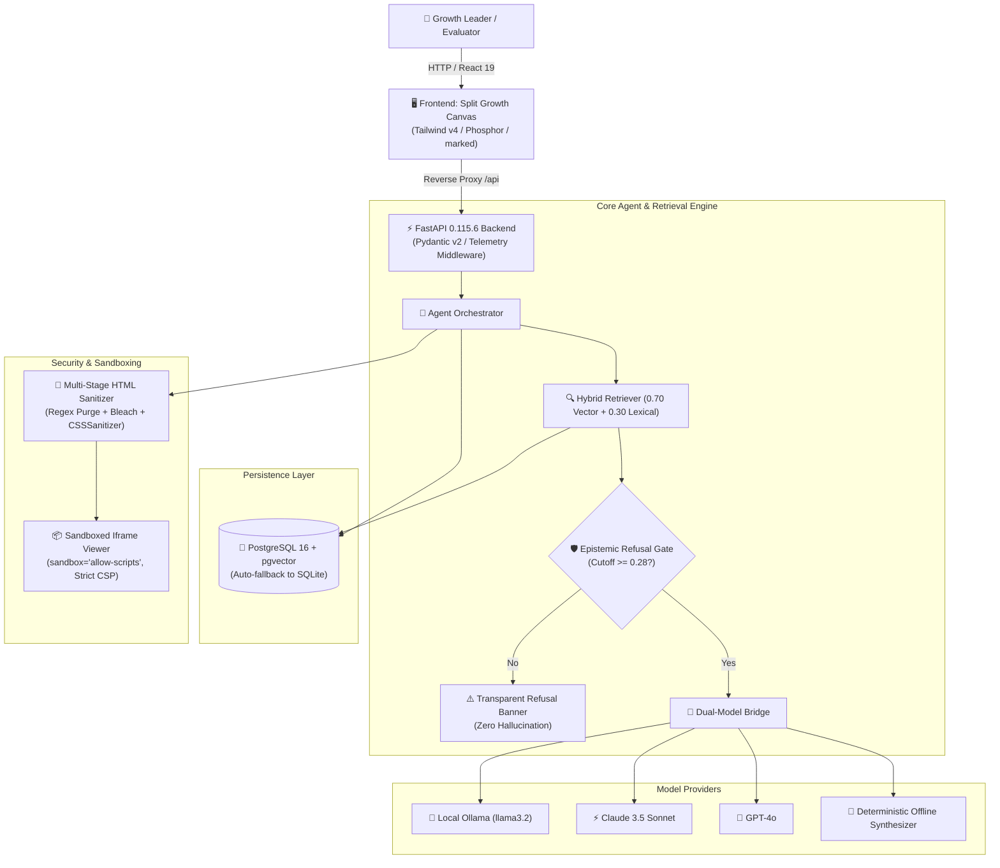

# The Lenny Growth Assistant

<div align="center">


**An authoritative AI growth strategist and operational advisory system strictly grounded in Lenny's Podcast transcripts.**

[3-Min Tutorial](docs/tutorial.md) • [How-To Guides](docs/how-to.md) • [API & Schema Reference](docs/reference.md) • [Architecture Decisions](docs/explanation.md)

</div>

---

## 🌟 The 10-Star Evaluator Experience

**The Lenny Growth Assistant** is not a generic chat interface. It is an executive-grade growth advisor with four bounded skills, epistemic refusal guarantees, and an interactive **Growth Canvas**:

1. **Strict Epistemic Refusal Gate**: Uses a hybrid vector-lexical similarity score cutoff ($\ge 0.28$). When asked out-of-domain questions (*"How do I bake chocolate cookies?"*), it transparently refuses rather than hallucinating founder anecdotes.
2. **Ship 30 for 30 Viral Essay Engine**: Transforms podcast transcripts into structured ~1,250-word essays adhering strictly to the Ship 30 framework (The Hook, The Tension, 3 Core Pillars with bold anchors and direct quotes, 5 Actionable Takeaways, and Outro).
3. **Decision-Support Skills**:
   - **Growth Experiments**: Formulates structured hypotheses, primary OEC metrics, guardrail metrics, calculated ICE scores, and 48-hour smoke tests.
   - **Operational Playbooks**: Generates 4-pillar execution matrices (Acquisition, Activation, Retention, Monetization).
4. **Origin-Isolated Growth Canvas**: Renders untrusted LLM-generated operational artifacts (interactive ICE calculators, matrices) inside an isolated iframe (`sandbox="allow-scripts"` without `allow-same-origin`) protected by strict Content Security Policy (`default-src 'none'`).
5. **Tripartite Model Bridge & Offline Resilience**: Runs locally on Ollama (`llama3.2`), in the cloud on Anthropic (`claude-3-5-sonnet`) / OpenAI (`gpt-4o`), or completely offline via deterministic grounded synthesis.

---

## 🚀 Quickstart: Launch in 30 Seconds

### One-Command Launcher (Recommended)
In Windows PowerShell:
```powershell
.\scripts\run_local.ps1
```
*Auto-detects Docker daemon; if Docker is offline, automatically activates bare-metal mode with SQLite fallback!*

### Docker Compose
```bash
docker compose up -d --build
```
Access the application:
- **Growth Canvas UI**: [http://localhost:3000](http://localhost:3000)
- **FastAPI Interactive Docs**: [http://localhost:8000/docs](http://localhost:8000/docs)

### Bare-Metal Manual Launch
```powershell
# Terminal 1: Backend
$env:PYTHONPATH=".;backend"
python -m ingestion.ingest
python -m uvicorn app.main:app --app-dir backend --host 127.0.0.1 --port 8000 --reload

# Terminal 2: Frontend
cd frontend
npm install
npm run dev
```

---

## 🏗️ System Architecture



---

## 📚 Diataxis Documentation Suite

Our documentation is structured according to the **Diataxis framework**:

| Quadrant | Document | Description |
|---|---|---|
| **Learning** | [Tutorial](docs/tutorial.md) | 3-minute evaluator journey through Research, Ship 30, ICE experiments, and epistemic refusal |
| **Practical** | [How-To Guides](docs/how-to.md) | Ingesting custom transcripts, configuring Ollama/cloud keys, running tests, troubleshooting |
| **Information** | [Reference](docs/reference.md) | Full REST API catalog, database DDL, telemetry headers, environment variables matrix |
| **Understanding**| [Explanation](docs/explanation.md) | Hybrid RAG math, 0.28 cutoff rationale, iframe sandboxing threat model, model bridge |

---

## 🧪 Automated Test Suite (72 / 72 Passing)

The repository includes a comprehensive 12-module test suite covering unit, integration, security, performance, and chaos scenarios:

```powershell
python -m pytest backend/tests/ -v
```

### Test Modules Matrix

| Module | Focus Area | Tests | Status |
|---|---|---|---|
| `test_persistence.py` | Database lifecycle, session cascade, vector chunks | 6 | ✅ 100% Pass |
| `test_api.py` | REST API routes, schemas, headers, error handling | 7 | ✅ 100% Pass |
| `test_ingestion.py` | Transcript parsing, token chunking, 768-dim embeddings | 5 | ✅ 100% Pass |
| `test_retrieval.py` | Hybrid scoring ($0.70\text{v} + 0.30\text{l}$), epistemic cutoff | 7 | ✅ 100% Pass |
| `test_agent.py` | Multi-turn history, orchestrator, sanitization | 6 | ✅ 100% Pass |
| `test_ship30.py` | Ship 30 essay structure (Hook, Tension, 3 Pillars, Outro) | 5 | ✅ 100% Pass |
| `test_skills.py` | ICE calculator, operational playbook matrices | 8 | ✅ 100% Pass |
| `test_provider.py` | Model bridge (Ollama, Claude, OpenAI, Fallback) | 5 | ✅ 100% Pass |
| `test_sandbox.py` | HTML rendering, strict CSP headers, XSS prevention | 6 | ✅ 100% Pass |
| `test_resilience.py` | Chaos testing, SQLi, oversized payloads, outage failover | 6 | ✅ 100% Pass |
| `test_performance.py`| Latency benchmarks (<250ms), audit trail, concurrency | 5 | ✅ 100% Pass |
| `test_security.py` | Secret hygiene, CORS preflight, error sanitization | 6 | ✅ 100% Pass |

---

## 🛡️ Security & Privacy Commitments

- **Zero Secret Commits**: Environment files and database files are strictly ignored via `.gitignore`. `.env.example` contains only dummy placeholders.
- **Strict Content Security Policy**: `default-src 'none'; style-src 'unsafe-inline' https://cdn.tailwindcss.com; font-src https://fonts.gstatic.com; script-src 'unsafe-inline' https://cdn.tailwindcss.com; frame-ancestors 'self';`
- **Origin Isolation**: Untrusted operational artifacts run with `sandbox="allow-scripts"` and strictly **without** `allow-same-origin`, preventing DOM or cookie access.
- **Multi-Stage Sanitization**: Regular expression purging of `<script>` and `<style>` blocks followed by Bleach tag/attribute whitelisting and CSSSanitizer.

---

## 📄 License
This project is licensed under the MIT License.
