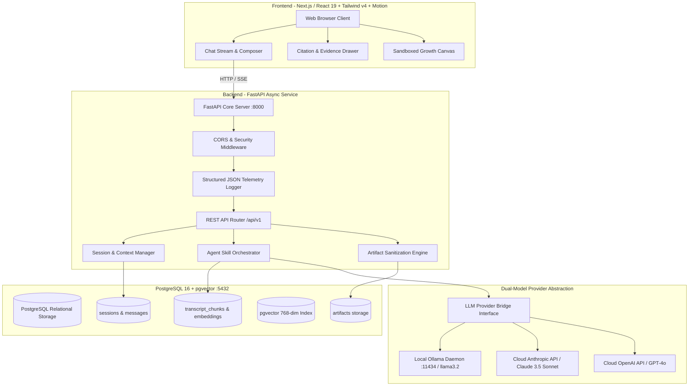
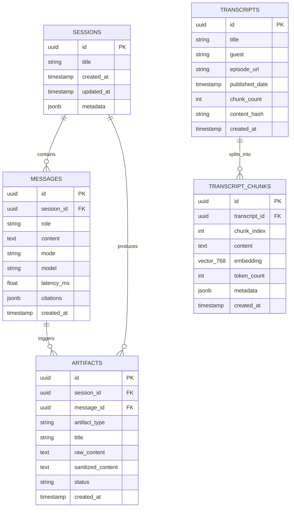
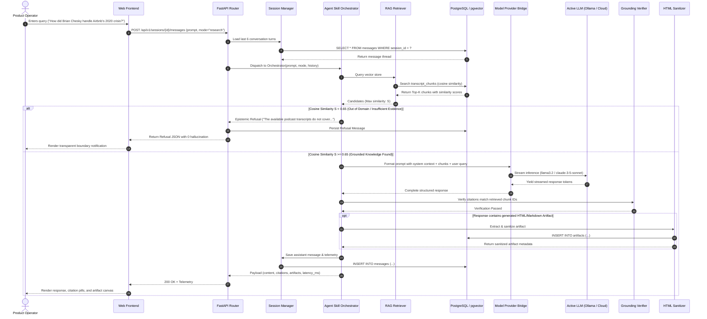
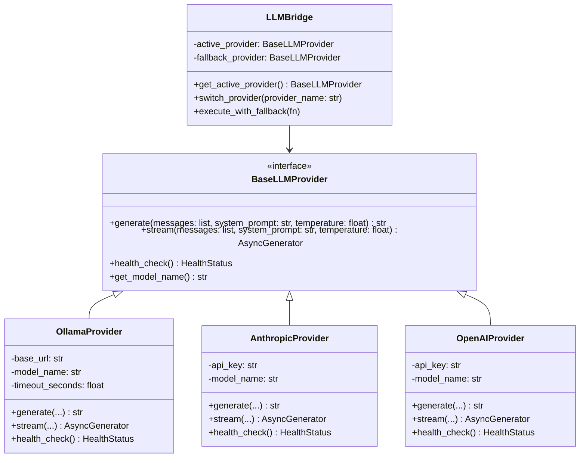
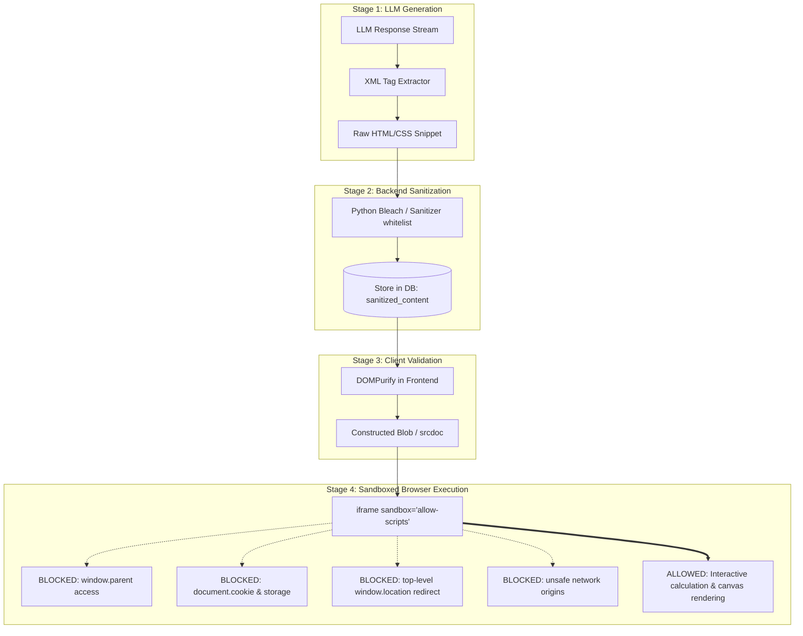
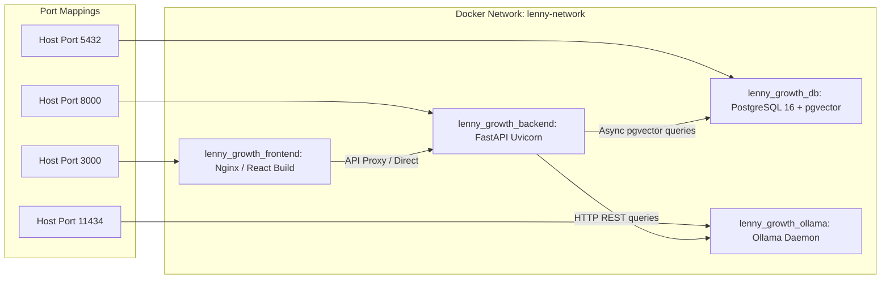

# System Architecture & Technical Design Specification
# The Lenny Growth Assistant

**Document Version:** 2.0.0 (Stage 2 — Engineering Architecture & Technical Design)  
**Status:** Approved for Design System (Stage 3) & Implementation Planning  
**Role:** Staff Backend, Systems & AI Security Architect  
**Review Standard:** gstack `/plan-eng-review` Architectural Gate  

---

## 1. System Topology & Service Boundaries

The Lenny Growth Assistant is built as a hardened four-tier containerized topology. The architecture enforces strict separation of concerns, asynchronous non-blocking I/O, and defense-in-depth isolation.



---

## 2. Database Schema Specification (PostgreSQL 16 + pgvector)

The database utilizes relational integrity for conversational history paired with the `pgvector` extension for cosine-similarity transcript retrieval.



### 2.1 SQL DDL & Index Definitions
```sql
-- Enable pgvector extension
CREATE EXTENSION IF NOT EXISTS "uuid-ossp";
CREATE EXTENSION IF NOT EXISTS vector;

-- Sessions Table
CREATE TABLE sessions (
    id UUID PRIMARY KEY DEFAULT uuid_generate_v4(),
    title VARCHAR(255) NOT NULL DEFAULT 'New Growth Session',
    created_at TIMESTAMP WITH TIME ZONE DEFAULT NOW(),
    updated_at TIMESTAMP WITH TIME ZONE DEFAULT NOW(),
    metadata JSONB DEFAULT '{}'::jsonb
);

-- Messages Table
CREATE TABLE messages (
    id UUID PRIMARY KEY DEFAULT uuid_generate_v4(),
    session_id UUID NOT NULL REFERENCES sessions(id) ON DELETE CASCADE,
    role VARCHAR(32) NOT NULL, -- 'user' | 'assistant' | 'system'
    content TEXT NOT NULL,
    mode VARCHAR(64) DEFAULT 'research', -- 'research' | 'ship30' | 'experiment' | 'playbook'
    model VARCHAR(64) NOT NULL, -- 'llama3.2' | 'claude-3-5-sonnet-latest'
    latency_ms DOUBLE PRECISION DEFAULT 0.0,
    citations JSONB DEFAULT '[]'::jsonb,
    created_at TIMESTAMP WITH TIME ZONE DEFAULT NOW()
);

-- Transcripts Table
CREATE TABLE transcripts (
    id UUID PRIMARY KEY DEFAULT uuid_generate_v4(),
    title VARCHAR(255) NOT NULL,
    guest VARCHAR(128) NOT NULL,
    episode_url VARCHAR(512),
    published_date TIMESTAMP WITH TIME ZONE,
    chunk_count INT DEFAULT 0,
    content_hash VARCHAR(64) UNIQUE NOT NULL,
    created_at TIMESTAMP WITH TIME ZONE DEFAULT NOW()
);

-- Transcript Chunks Table with 768-dim embeddings
CREATE TABLE transcript_chunks (
    id UUID PRIMARY KEY DEFAULT uuid_generate_v4(),
    transcript_id UUID NOT NULL REFERENCES transcripts(id) ON DELETE CASCADE,
    chunk_index INT NOT NULL,
    content TEXT NOT NULL,
    embedding VECTOR(768) NOT NULL,
    token_count INT DEFAULT 0,
    metadata JSONB DEFAULT '{}'::jsonb,
    created_at TIMESTAMP WITH TIME ZONE DEFAULT NOW()
);

-- Vector Cosine Similarity Index (IVFFlat)
CREATE INDEX idx_chunks_embedding ON transcript_chunks 
USING ivfflat (embedding vector_cosine_ops) WITH (lists = 100);

-- Relational Indexes
CREATE INDEX idx_messages_session ON messages(session_id, created_at ASC);
CREATE INDEX idx_chunks_transcript ON transcript_chunks(transcript_id, chunk_index);

-- Artifacts Table
CREATE TABLE artifacts (
    id UUID PRIMARY KEY DEFAULT uuid_generate_v4(),
    session_id UUID NOT NULL REFERENCES sessions(id) ON DELETE CASCADE,
    message_id UUID REFERENCES messages(id) ON DELETE SET NULL,
    artifact_type VARCHAR(32) NOT NULL, -- 'html' | 'markdown' | 'calc'
    title VARCHAR(255) NOT NULL,
    raw_content TEXT NOT NULL,
    sanitized_content TEXT NOT NULL,
    status VARCHAR(32) DEFAULT 'sanitized', -- 'sanitized' | 'rejected'
    created_at TIMESTAMP WITH TIME ZONE DEFAULT NOW()
);
```

---

## 3. End-to-End Request Flow & Agent Routing

The agent layer avoids monolithic system prompts by implementing a bounded intent dispatcher that routes incoming queries to specialized skills.



---

## 4. API Specifications & Contracts

All endpoints use Pydantic v2 schemas for strict type safety and auto-generated OpenAPI documentation.

### 4.1 Health & Diagnostics
- **`GET /api/v1/health`**: Overall service uptime and system health.
- **`GET /api/v1/health/db`**: PostgreSQL connection pool status and query latency.
- **`GET /api/v1/health/llm`**: Active model provider connectivity (`ollama` or `anthropic`) and round-trip response time.

```json
// Response Schema: GET /api/v1/health/llm
{
  "status": "healthy",
  "provider": "ollama",
  "active_model": "llama3.2:latest",
  "latency_ms": 42.1,
  "fallback_ready": true,
  "fallback_provider": "anthropic"
}
```

### 4.2 Sessions & Messages
- **`POST /api/v1/sessions`**: Create a new conversation thread.
- **`GET /api/v1/sessions`**: List conversation sessions sorted by `updated_at`.
- **`GET /api/v1/sessions/{id}`**: Get full session details and metadata.
- **`GET /api/v1/sessions/{id}/messages`**: Fetch message history for a session.
- **`POST /api/v1/sessions/{id}/messages`**: Submit a user prompt to the agent orchestrator.

```json
// Request Schema: POST /api/v1/sessions/{id}/messages
{
  "content": "Explain Shreyas Doshi's LNO framework and how to apply it.",
  "mode": "ship30", // "research" | "ship30" | "experiment" | "playbook"
  "provider_override": null // optional: "ollama" | "anthropic"
}

// Response Schema: POST /api/v1/sessions/{id}/messages
{
  "id": "7c9e6679-7425-40de-944b-e07fc1f90ae7",
  "session_id": "3b7defe3-3ca9-45af-ba50-249c0953efcb",
  "role": "assistant",
  "content": "# The Perfectionist Trap: Why High Performers Fail...",
  "mode": "ship30",
  "model": "llama3.2:latest",
  "latency_ms": 3210.5,
  "citations": [
    {
      "chunk_id": "4b19c28e-89a2-4a7b-a2c3-1d87128f2dd5",
      "guest": "Shreyas Doshi",
      "title": "High-Agency Product Leadership",
      "similarity": 0.884,
      "excerpt": "LNO classifies your daily and weekly work into three distinct buckets..."
    }
  ],
  "artifacts": [
    {
      "id": "e4f0a2d1-93b8-4c12-8819-2a4b8c9d0e1f",
      "artifact_type": "html",
      "title": "Interactive LNO Priority Calculator",
      "status": "sanitized"
    }
  ],
  "created_at": "2026-09-13T21:30:00Z"
}
```

### 4.3 Artifact Endpoints
- **`GET /api/v1/artifacts/{id}`**: Retrieve sanitized artifact content and metadata for iframe rendering.

---

## 5. Dual-Model Provider Bridge Architecture

The model layer abstracts local and cloud LLMs behind a uniform protocol so that switching models requires zero application code modifications.



### Fallback Policy:
If the local Ollama daemon fails or times out ($> 15.0$s), and an `ANTHROPIC_API_KEY` is configured in `.env`, the `LLMBridge` automatically executes the query against Anthropic Claude 3.5 Sonnet, logging an operational telemetry warning.

---

## 6. Secure Artifact Isolation Architecture

Untrusted LLM-generated HTML poses severe risks: session hijacking, DOM manipulation, and cross-site scripting (XSS). The architecture establishes a multi-stage defense pipeline:



---

## 7. Deployment Topology (Docker Compose)

The production deployment consists of 4 lightweight, interdependent containers running within an isolated internal bridge network:



---

## 8. Observability & Structured JSON Telemetry

Every request generates a correlated structured log entry. Sensitive credentials (API keys, connection strings) are strictly excluded.

```json
{
  "timestamp": "2026-09-13T21:30:04.120Z",
  "request_id": "req_8f12a3b4c5",
  "session_id": "3b7defe3-3ca9-45af-ba50-249c0953efcb",
  "endpoint": "/api/v1/sessions/3b7defe3-3ca9-45af-ba50-249c0953efcb/messages",
  "mode": "ship30",
  "model": "llama3.2:latest",
  "provider": "ollama",
  "retrieval": {
    "top_similarity": 0.884,
    "chunks_retrieved": 4,
    "latency_ms": 28.4
  },
  "generation": {
    "tokens_emitted": 1248,
    "latency_ms": 3182.1,
    "ttft_ms": 480.2
  },
  "artifacts_generated": 1,
  "status_code": 200
}
```
