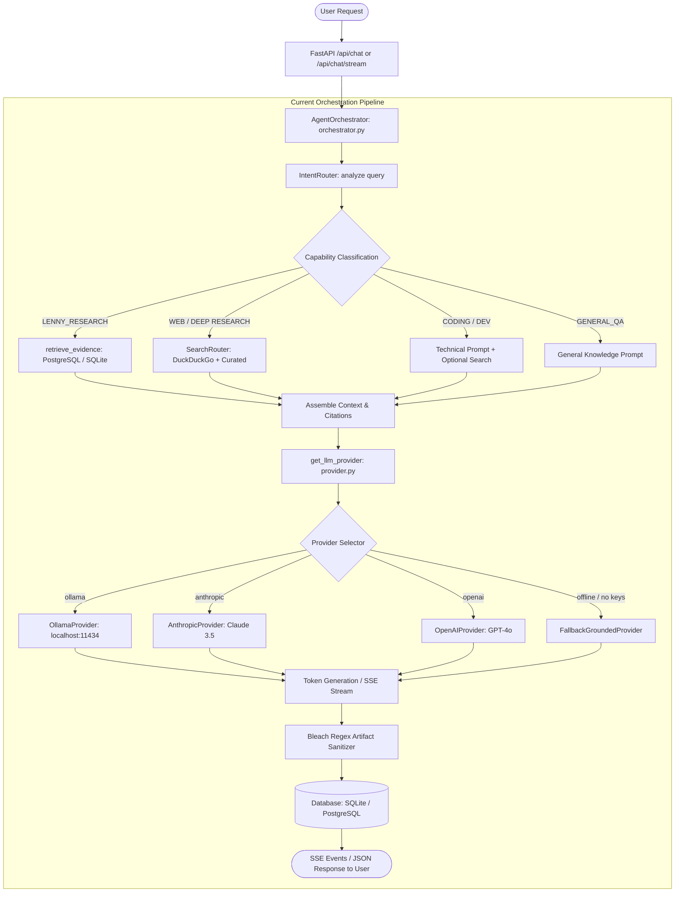
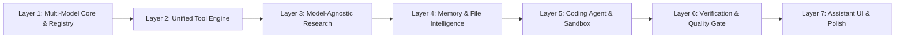

# AI Platform Architecture Audit & Unified Transformation Blueprint
`AI_PLATFORM_ARCHITECTURE_AUDIT.md`

> **Document Version**: 3.0.0  
> **Status**: COMPLETED AUDIT & STRATEGIC BLUEPRINT — PENDING USER REVIEW  
> **Target Product**: Unified General-Purpose AI Assistant Platform (Multi-Model, Multi-Tool, Research, Coding, Memory & Artifacts)  
> **Predecessor References**: `PRD.md`, `architecture.md`, `FULL_SPECTRUM_AGENT_AUDIT.md`, `RESEARCH_ARCHITECTURE_AUDIT.md`

---

## Executive Summary

The project is undergoing a decisive paradigm shift: **from a specialized "Lenny Growth Assistant" RAG chatbot into a sovereign, production-grade, General-Purpose AI Assistant Platform**.

Modern enterprise AI systems (inspired by ChatGPT, Claude, Gemini, and Groq) provide unified access to natural conversation, general knowledge, current real-time web research, deep investigative reports, code authoring/debugging, file intelligence, mathematics, and tool use. This transformation achieves that class of capability through our own clean, modular, and unencumbered architecture.

Under this paradigm:
1. **One Unified Assistant**: The user interacts with a single intelligent assistant that autonomously determines intent, selects optimal models, deploys necessary tools, gathers verified evidence, and synthesizes answers.
2. **Multi-Model Provider Core**: Native, uniform abstraction over **OpenAI, Anthropic, Google Gemini, Groq, and local Ollama** with automatic routing and graceful fallbacks.
3. **Model + Tool Separation**: LLMs are inference and reasoning engines; tools, search providers, code runners, and evidence pipelines are modular, model-independent services.
4. **Specialized Knowledge as a Skill**: Lenny podcast transcripts and growth frameworks are preserved as a high-authority specialized skill (`lenny_growth_intelligence`), strictly isolated from general and real-world queries.
5. **Strict Grounding & Verification**: Factual accuracy is established by primary evidence, web documents, and formal verification—not model consensus or hallucinated confidence.

---

## 1. Current Architecture & End-to-End Data Flow

The current repository represents a hybrid state resulting from the recent resolution of the `"Who is CM of AP"` bug and the introduction of initial multi-source search components.



### Current Data Flow Walkthrough
1. **Request Intake**: Incoming messages arrive via FastAPI (`POST /api/chat` or `POST /api/chat/stream`) containing `session_id`, `content`, `mode` (`auto`, `search`, `deep_research`, `coding`), and optional `provider_override`.
2. **Intent Analysis**: `get_query_understanding_engine().analyze(...)` classifies the query into one of 12 capability types and detects if the query is strictly relevant to Lenny's archive via `is_lenny_relevant()`.
3. **Retrieval Gating**:
   - If `LENNY_RESEARCH`, queries transcript chunks via cosine similarity on 768-dim embeddings.
   - If `WEB_RESEARCH` or `DEEP_RESEARCH`, dispatches queries to `SearchRouter` (DuckDuckGo Lite web scraping + Curated repository).
   - If `CODING` or `GENERAL_QA`, bypasses external retrieval unless the classification flagged `requires_web=True`.
4. **Context Assembly**: Context strings and `CitationSchema` instances are formatted and injected into prompt templates.
5. **Provider Invocation**: `get_llm_provider()` fetches the provider configured in `.env` (or override). If the daemon is unreachable or API keys are missing, it diverts to `FallbackGroundedProvider`.
6. **Artifact Extraction**: The assistant output is scanned for `<artifact type="..." title="...">` blocks, sanitized with `bleach` and `CSSSanitizer`, persisted to the `artifacts` table, and rendered in the frontend iframe canvas.

---

## 2. Current LLM Providers

Provider implementations reside in [`backend/app/models/provider.py`](file:///c:/Users/avina/OneDrive/Desktop/Lenny_Growth_Assistant/backend/app/models/provider.py).

| Provider Class | Target Service | Authentication | Streaming Support | Tool Calling | Status & Limitations |
|---|---|---|---|---|---|
| `BaseLLMProvider` | Abstract Base Class | N/A | Pseudo-streaming via token regex | ❌ None | Defines `generate()`, `generate_stream()`, `health_check()`. Lacks structured tool contracts. |
| `OllamaProvider` | Local Ollama (`localhost:11434`) | None | Native JSON stream (`/api/generate`) | ❌ None | Hardcoded to `llama3.2:latest`. Inflexible prompt schema. Fails if daemon is stopped. |
| `AnthropicProvider` | Anthropic Claude API | `ANTHROPIC_API_KEY` | ❌ Non-streaming (returns full string) | ❌ None | Hardcoded to `claude-3-5-sonnet-latest`. 2500 max_tokens limit. Lacks tool definitions. |
| `OpenAIProvider` | OpenAI Chat API | `OPENAI_API_KEY` | ❌ Non-streaming (returns full string) | ❌ None | Hardcoded to `gpt-4o`. 2500 max_tokens limit. Lacks native function/tool schemas. |
| `FallbackGroundedProvider` | Deterministic In-Memory Synthesizer | None | Simulated token cadence (5ms) | ❌ None | Rule-based responses for tests and offline mode. Does not perform generalized reasoning. |
| **Google Gemini** | **Google GenAI / REST** | `GEMINI_API_KEY` | ❌ **Missing** | ❌ None | **Not implemented.** No adapter exists. |
| **Groq** | **Groq Cloud API** | `GROQ_API_KEY` | ❌ **Missing** | ❌ None | **Not implemented.** No adapter exists. |

---

## 3. Current Model Selection

### How Model Selection Operates Today
- **Static Global Configuration**: Set via `LLM_PROVIDER` in `.env` (`ollama`, `anthropic`, `openai`).
- **Runtime Override**: The API accepts a query string or header `provider_override` (e.g., `?provider=openai`).
- **No Dynamic Router**: The system lacks any logic to inspect task requirements (e.g., "fast query -> Groq", "deep coding -> Claude 3.5 Sonnet / GPT-4o", "large document -> Gemini 1.5 Pro 1M context").
- **No Model Registry**: Model identifiers, context window limits, token costs, and supported modalities are not tracked in metadata. Everything is hardcoded as strings in `provider.py`.

---

## 4. Current Agent Layer

The agent logic is concentrated in [`backend/app/agents/orchestrator.py`](file:///c:/Users/avina/OneDrive/Desktop/Lenny_Growth_Assistant/backend/app/agents/orchestrator.py) (883 lines).

### Strengths
- Intent-First execution prevents vector collision bugs.
- 12 fine-grained capabilities: `GENERAL_QA`, `FACTUAL`, `WEB_RESEARCH`, `DEEP_RESEARCH`, `CODING`, `DEBUGGING`, `ARCHITECTURE`, `DATA_ANALYSIS`, `DOCUMENT_INTELLIGENCE`, `WRITING`, `PLANNING`, `LENNY_RESEARCH`, `HYBRID_RESEARCH`.
- Dedicated system prompts in `app/agents/prompts.py`.
- LRU retrieval caching for fast response times.

### Deficiencies
- **Monolithic Procedure**: A single class `AgentOrchestrator` handles DB transactions, classification, search invocation, prompt string concatenation, SSE event formatting, and artifact regex replacement.
- **No Autonomous Agent Loop**: The model cannot decide mid-generation to invoke a tool, inspect the output, and take a follow-up action (ReAct or tool-use loop).
- **Rigid Branching**: Execution is determined by a rigid `if/elif` cascade rather than an extensible task planner.

---

## 5. Current Tools

Tools currently exist as ad-hoc utility classes rather than standardized, invokable tools:

```
Current Ad-Hoc Utilities:
├── DuckDuckGoProvider (web_provider.py) -> Web scraping
├── CuratedKnowledgeProvider (curated_provider.py) -> In-memory facts
├── retrieve_evidence (retriever.py) -> SQL vector retrieval
├── sanitize_artifact_content (orchestrator.py) -> HTML Bleach sanitization
└── Sandbox Test Runner (test_sandbox.py) -> Mock unit test execution
```

### Deficiencies
- **No Unified Interface**: Lacks a standard `Tool` base class declaring `name`, `description`, `input_schema` (JSON Schema), `execute()`, `timeout`, `permissions`, and `result_schema`.
- **Incompatible with Model Tool Calling**: Models cannot receive a tool list to autonomously output `tool_calls`.
- **No Tool Router**: No centralized registry to validate tool permissions, rate-limit calls, handle timeouts, or normalize outputs into a standard `ToolResult`.

---

## 6. Current Research System

Implemented in `backend/app/services/search/`:
- **`ResearchPlanner`**: Evaluates query domain, freshness requirement (`stable`, `recent`, `current`, `latest`), research depth (`direct`, `targeted`, `standard`, `deep`, `exhaustive`), and generates 2–4 sub-queries.
- **`SourceQualityEngine`**: Domain authority scoring (`0.10` to `0.98`), title-based deduplication, conflict detection regexes, and qualitative evidence rating (`Strong`, `Moderate`, `Limited`).
- **`CuratedKnowledgeProvider`**: Fast in-memory authoritative records for high-frequency real-world facts (e.g., AP Chief Minister, state capitals, framework versions).
- **`DuckDuckGoProvider`**: HTTP scraping using DuckDuckGo Lite with URL decode parsing and redirect unnesting.
- **`SearchRouter`**: Coordinates execution and formats context blocks inside `<external_evidence_untrusted>` tags.

### Deficiencies
- Web scraping relies entirely on DuckDuckGo HTML without alternative search providers (Serper, Tavily, Bing, Google Search, ArXiv, PubMed, SEC EDGAR).
- Only extracts search result snippets; cannot crawl or scrape full target page content for in-depth analysis.
- The research system is not isolated as a standalone, model-agnostic `ResearchEngine` that outputs an immutable, verifiable `ResearchResult` artifact.

---

## 7. Current Lenny Integration

- **Storage**: 63 segmented chunks in `transcripts` and `transcript_chunks` tables with 768-dimensional embeddings.
- **Gating**: Gated behind `is_lenny_relevant()` regex checks in `app/services/capability/intent_router.py`. If a query lacks Lenny-specific keywords or guest names, transcript retrieval is completely bypassed.
- **Encapsulation Status**: While functionally gated, the system still carries growth-specific branding ("Growth Canvas", "growth_assistant", "Lenny Growth Assistant"). Lenny must be refactored into a modular plugin/skill (`LennyGrowthIntelligence`) within a clean general-purpose platform.

---

## 8. Current Frontend Architecture

Located in `frontend/src/`:
- **Framework**: React 18, Vite, Tailwind CSS, Lucide icons.
- **Component Hierarchy**:
  ```
  App.jsx
  ├── Header.jsx (Status indicator, latency counter, active session title)
  ├── Sidebar.jsx (Session history, new chat button, session deletion)
  ├── ChatWindow.jsx (Message stream, markdown rendering, citation badges)
  │    ├── ChatInput.jsx (Auto-expanding textarea, mode selector, submit button)
  │    └── EvidenceDrawer.jsx (Slide-out drawer showing citations and quality breakdown)
  └── GrowthCanvas.jsx (Sandboxed iframe rendering HTML artifacts)
  ```
- **Streaming Client**: Custom `fetch` with `ReadableStream` reader in `App.jsx` handling SSE lines (`event: phase`, `token`, `routing`, `citations`, `artifacts`, `metrics`, `done`).

### Deficiencies
- Branded as a growth tool rather than a sovereign general AI assistant.
- Lacks a dynamic Model Selector (`Auto`, `OpenAI`, `Claude`, `Gemini`, `Groq`, `Ollama`).
- Lacks a Tool Telemetry Bar showing live step-by-step progress (e.g., "Executing Python sandbox...", "Searching arXiv...").
- Lacks File Upload UI (drag-and-drop zone, file attachment chips, document preview).
- Lacks Chat Editing, Forking, or Regenerate controls.

---

## 9. Current Backend Architecture

- **Framework**: FastAPI with Uvicorn ASGI server (`backend/app/main.py`).
- **Routing**: `backend/app/api/routes.py` exposes:
  - `POST /api/chat` (synchronous execution)
  - `POST /api/chat/stream` (SSE streaming execution)
  - `GET /api/sessions`, `POST /api/sessions`, `DELETE /api/sessions/{id}`
  - `GET /api/sessions/{id}/artifacts`
  - `GET /api/health`, `GET /api/models/health`
- **Configuration**: Pydantic BaseSettings in `app/core/config.py` reading from `.env`.

### Deficiencies
- No API endpoints for file uploads (`/api/files/upload`).
- No endpoint for stopping/cancelling running requests (`/api/tasks/{task_id}/cancel`).
- No provider-level model catalog endpoint (`/api/models`).

---

## 10. Current Database Schema

SQLAlchemy 2.0 ORM models in `backend/app/db/models.py`:
- **`Session`**: `id` (UUID), `title`, `created_at`, `updated_at`, `meta_info` (JSON string).
- **`Message`**: `id` (UUID), `session_id`, `role`, `content`, `mode`, `model`, `latency_ms`, `citations` (JSON string), `created_at`.
- **`Transcript`**: `id`, `title`, `guest`, `episode_url`, `published_date`, `chunk_count`, `content_hash`.
- **`TranscriptChunk`**: `id`, `transcript_id`, `chunk_index`, `content`, `embedding_json` (JSON float array), `token_count`, `meta_info`.
- **`Artifact`**: `id`, `session_id`, `message_id`, `artifact_type`, `title`, `raw_content`, `sanitized_content`, `status`, `created_at`.
- **`RetrievalLog`**: `id`, `query`, `top_similarity`, `chunks_count`, `latency_ms`, `grounded`, `created_at`.

### Deficiencies
- No tables for uploaded files: `user_files`, `file_chunks`, `file_embeddings`.
- No table for task state or execution trees: `agent_runs`, `tool_executions`.
- No memory storage for user preferences and compacted facts: `user_memories`.

---

## 11. Current Streaming Implementation

- Streams UTF-8 text via Server-Sent Events (`StreamingResponse(media_type="text/event-stream")`).
- Emits structured JSON events:
  - `event: phase` -> Pipeline progress updates
  - `event: routing` -> Capability and intelligence mode
  - `event: citations` -> Evidence sources
  - `event: token` -> Incremental text tokens
  - `event: artifacts` -> Extracted artifact metadata
  - `event: metrics` -> Latency metrics (TTFT, LLM time, total time)
  - `event: done` -> Final message ID

### Deficiencies
- Token generation is wrapped in synchronous generators within thread executors.
- Providers lack real-time native async streaming with cancellation token handling (`asyncio.CancelledError`).
- If a user closes the browser or disconnects, backend tasks continue executing to completion without interruption.

---

## 12. Current File Handling

- **Current Status**: **Non-existent in runtime API.**
- The system only supports ingestion of pre-formatted transcript text files via offline CLI scripts (`ingestion/parse_transcripts.py`).
- Users cannot upload PDFs, Word documents, Excel spreadsheets, CSVs, or code repositories.

---

## 13. Current Artifact System

- Artifacts are embedded in assistant outputs via XML-like tags:
  ```html
  <artifact type="html" title="Architecture Diagram">
    <div class="p-4 bg-slate-900">...</div>
  </artifact>
  ```
- Strips `<script>` and `<style>` blocks with regex; sanitizes elements using `bleach` and `CSSSanitizer`.
- Saves record in the `artifacts` table and replaces the tag with a markdown note.
- Rendered in frontend iframe with `sandbox="allow-scripts"`.

### Deficiencies
- Exclusively focuses on HTML artifacts; lacks first-class rendering for Markdown reports, interactive React components, SVG diagrams, Mermaid flowcharts, code diff blocks, or tabular datasets.
- Cannot download artifacts directly as `.py`, `.json`, `.csv`, or `.pdf`.

---

## 14. Current Security Posture

### Implemented Controls
- API keys kept strictly in backend `.env` (never exposed to client).
- HTML artifact sanitization using Bleach whitelist.
- Prompt injection redaction in web snippets (`INJECTION_ATTACK_REGEX`).
- CORS origin restriction.

### Vulnerabilities & Gaps
- **Lack of SSRF Protection**: Search and URL fetching does not restrict private internal IP ranges (`127.0.0.1`, `10.0.0.0/8`, `192.168.0.0/16`, AWS metadata `169.254.169.254`).
- **Unsandboxed Code Execution**: The current codebase does not offer a safe containerized or gVisor/WASM sandbox for user-requested code execution.
- **No Rate Limiting**: The API lacks request rate limiting or anti-DoS safeguards.

---

## 15. Current Test Suite

The test suite contains **16 test files** in `backend/tests/` totaling **94 tests**:
- `test_agent.py`, `test_api.py`, `test_full_spectrum_agent.py`, `test_ingestion.py`, `test_performance.py`, `test_persistence.py`, `test_provider.py`, `test_research_engine.py`, `test_resilience.py`, `test_retrieval.py`, `test_sandbox.py`, `test_security.py`, `test_ship30.py`, `test_skills.py`, `test_streaming_and_speed.py`.
- **Pass Rate**: **94 / 94 passing (100%) in 92.21 seconds**.
- **Crucial Requirement**: Any modifications must preserve 100% backward compatibility with these 94 tests.

---

## 16. Current Failures & Bottlenecks

1. **Provider Lock-In & Gaps**: Only Ollama, Anthropic, and OpenAI are partially integrated. Gemini and Groq are completely absent.
2. **Missing Autonomous Tool Invocation**: LLMs cannot autonomously query tools, evaluate tool returns, and refine execution.
3. **Absence of Document Intelligence**: Cannot analyze uploaded user documents, spreadsheets, or codebases.
4. **Context Window Saturation**: Multi-turn sessions send full message history without summarization or token compaction, risking context window overflow on long conversations.
5. **Brand & Experience Mismatch**: The platform still presents as a niche startup growth tool rather than a sovereign general AI assistant.

---

## 17. Root Causes

- **Evolutionary Debt**: Originating as a specialized RAG bot for podcast transcripts, the architecture initially coupled all logic to transcript chunk vector retrieval.
- **Ad-Hoc Prototyping**: Capabilities were introduced as discrete `if/elif` branches in a single orchestrator file rather than modular layers.
- **Lack of Provider & Tool Abstractions**: Model and search integrations lacked unified, polymorphic interfaces with standardized schemas.

---

## 18. Missing Capabilities Required for the Unified Platform

1. **Multi-Model Provider Adapters**: First-class support for `OpenAIProvider`, `AnthropicProvider`, `GeminiProvider`, `GroqProvider`, and `OllamaProvider`.
2. **Model Registry & Dynamic Router**: Centralized catalog with capabilities, context windows, and cost metadata; intelligent routing selecting the ideal model per query.
3. **Unified Tool Engine & Tool Router**: Polymorphic `Tool` interface with JSON schema definitions, permissions, timeouts, and structured execution.
4. **Model-Independent Research Engine**: Standalone research planner, crawler, evaluator, and synthesizer producing self-contained `ResearchResult` objects.
5. **File Intelligence Pipeline**: High-throughput parser for PDF, DOCX, XLSX, CSV, JSON, and source code with automatic chunking and vector indexing.
6. **Conversational Memory & Compaction**: Automatic context summarization, key fact/decision extraction, and token budget management.
7. **Coding & Sandboxed Execution Agent**: Repository-aware code analysis, AST inspection, test generation, and isolated execution.
8. **Multi-Model Verification & Critique**: Cross-model claim checking and contradiction detection for high-stakes research queries.
9. **Universal AI Assistant UI**: Sleek, unbranded modern interface with dynamic model picker, tool telemetry, rich multi-format artifact canvas, and file attachment support.

---

## 19. Proposed Unified Platform Architecture

```
                                  USER
                                   │
                                   ▼
                      ┌─────────────────────────┐
                      │    API Gateway & SSE    │
                      │  (FastAPI / WebSockets) │
                      └────────────┬────────────┘
                                   │
                                   ▼
                      ┌─────────────────────────┐
                      │   Conversation Manager  │
                      │  Context Compaction &   │
                      │      Memory Cache       │
                      └────────────┬────────────┘
                                   │
                                   ▼
                      ┌─────────────────────────┐
                      │  Intent & Task Planner  │
                      │ (Capability & Plan Gen) │
                      └────────────┬────────────┘
                                   │
               ┌───────────────────┴───────────────────┐
               ▼                                       ▼
    ┌──────────────────────┐                ┌──────────────────────┐
    │  Direct / Reasoning  │                │    Research Needed   │
    │      Task Path       │                │      Task Path       │
    └──────────┬───────────┘                └──────────┬───────────┘
               │                                       │
               │                            ┌──────────▼───────────┐
               │                            │ Deep Research Engine │
               │                            │ (Multi-Query / Eval) │
               │                            └──────────┬───────────┘
               │                                       │
               └───────────────────┬───────────────────┘
                                   │
                                   ▼
                      ┌─────────────────────────┐
                      │    Tool Router & Hub    │
                      │ (Web, Code, Files, RAG) │
                      └────────────┬────────────┘
                                   │
                                   ▼
                      ┌─────────────────────────┐
                      │     Evidence Layer      │
                      │ (Deduplication, Claims) │
                      └────────────┬────────────┘
                                   │
                                   ▼
                      ┌─────────────────────────┐
                      │   Model Router & Pool   │
                      │ (Auto / User Selected)  │
                      └────────────┬────────────┘
                                   │
          ┌─────────────┬──────────┼──────────┬─────────────┐
          ▼             ▼          ▼          ▼             ▼
     ┌─────────┐   ┌─────────┐┌─────────┐┌─────────┐   ┌─────────┐
     │ OpenAI  │   │ Claude  ││ Gemini  ││  Groq   │   │ Ollama  │
     │ Adapter │   │ Adapter ││ Adapter ││ Adapter │   │ Adapter │
     └────┬────┘   └────┬────┘└────┬────┘└────┬────┘   └────┬────┘
          └─────────────┴──────────┼──────────┴─────────────┘
                                   │
                                   ▼
                      ┌─────────────────────────┐
                      │   Verification Layer    │
                      │ (Cross-Check & Critique)│
                      └────────────┬────────────┘
                                   │
                                   ▼
                      ┌─────────────────────────┐
                      │   Response Composer &   │
                      │      Quality Gate       │
                      └────────────┬────────────┘
                                   │
                                   ▼
                                 USER
```

---

## 20. Layered Implementation & Migration Plan

To maintain stability and ensure zero regressions across all 94 baseline tests, the transformation will execute across **7 sequential layers**. Each layer follows a strict lifecycle: **BUILD → TEST → VERIFY → DOCUMENT → INTEGRATE**.



### Layer Breakdown
- **Layer 1: Multi-Model Core & Registry**:
  - Implement uniform `LLMProvider` interface.
  - Build adapters: `OpenAIProvider`, `AnthropicProvider`, `GeminiProvider`, `GroqProvider`, `OllamaProvider`.
  - Build `ModelRegistry` (metadata, capabilities, context limits, pricing, latency tiers).
  - Build `ModelRouter` (automatic dynamic selection + manual override validation).
- **Layer 2: Unified Tool Architecture & Tool Router**:
  - Implement base `Tool` specification with JSON schema validation.
  - Implement core tools: `web_search`, `web_fetch`, `code_sandbox`, `file_reader`, `calculator`, `lenny_retrieval`.
  - Implement `ToolRouter` with timeout control, permission checks, and `ToolResult` normalization.
- **Layer 3: Model-Independent Research & Deep Research Engine**:
  - Refactor research planner into standalone `ResearchEngine`.
  - Multi-query decomposition, parallel category search, source scraping, deduplication, conflict detection.
  - Produces standalone `ResearchResult` object consumable by any model adapter.
- **Layer 4: Conversational Memory & File Intelligence**:
  - Implement sliding-window context compaction and key fact/decision extraction.
  - Implement multi-format document parser (PDF, DOCX, XLSX, CSV, JSON, code).
  - In-memory/vector indexing for user uploaded files.
- **Layer 5: Coding Agent & Sandboxed Runner**:
  - Repository inspection tools (directory traversal, file read/write, git status).
  - Multi-step code planner, test runner, syntax validator.
  - Isolated subprocess/sandbox execution environment.
- **Layer 6: Verification Layer & Response Quality Gate**:
  - Multi-model verification pipeline for high-risk or complex queries.
  - Response quality gate evaluating relevance, grounding, completeness, citations, and formatting.
- **Layer 7: Assistant UI Transformation & Telemetry**:
  - Complete UI overhaul into a modern general-purpose AI assistant.
  - Dynamic model selector, tool execution steppers, artifact viewer, file attachment zone.

---

## 21. Provider Integration Plan

### Standard Provider Contract

```python
from abc import ABC, abstractmethod
from typing import AsyncGenerator, Dict, Any, List, Optional
from pydantic import BaseModel

class ProviderMessage(BaseModel):
    role: str  # "system", "user", "assistant", "tool"
    content: str
    name: Optional[str] = None
    tool_call_id: Optional[str] = None
    tool_calls: Optional[List[Dict[str, Any]]] = None

class ProviderResponse(BaseModel):
    content: str
    model: str
    tool_calls: Optional[List[Dict[str, Any]]] = None
    usage: Dict[str, int]
    finish_reason: str
    latency_ms: float

class LLMProvider(ABC):
    @abstractmethod
    async def generate(
        self,
        messages: List[ProviderMessage],
        tools: Optional[List[Dict[str, Any]]] = None,
        temperature: float = 0.7,
        max_tokens: int = 4096,
    ) -> ProviderResponse:
        """Execute non-streaming inference with optional tool definitions."""
        pass

    @abstractmethod
    async def generate_stream(
        self,
        messages: List[ProviderMessage],
        tools: Optional[List[Dict[str, Any]]] = None,
        temperature: float = 0.7,
        max_tokens: int = 4096,
    ) -> AsyncGenerator[str, None]:
        """Yield tokens and tool call deltas progressively."""
        pass

    @abstractmethod
    async def health_check(self) -> Dict[str, Any]:
        """Return provider availability, active model, and latency."""
        pass
```

### Supported Providers & Models

```
├── OpenAIProvider
│   ├── gpt-4o (Default strong reasoning & multimodal)
│   ├── gpt-4o-mini (Fast, low-cost general tasks)
│   └── o1 / o3-mini (Complex mathematical & algorithmic reasoning)
├── AnthropicProvider
│   ├── claude-3-5-sonnet-latest (Top-tier coding, architecture, writing)
│   └── claude-3-5-haiku-latest (High-speed, low-latency reasoning)
├── GeminiProvider
│   ├── gemini-1.5-pro (Massive 1M+ context window, document analysis)
│   └── gemini-1.5-flash (High-throughput multimodal search)
├── GroqProvider
│   ├── llama-3.3-70b-versatile (Sub-second inference, fast coding)
│   └── mixtral-8x7b-32768 (Low latency general analysis)
└── OllamaProvider
    ├── llama3.2:latest (Local, air-gapped private tasks)
    └── qwen2.5-coder:latest (Local offline coding)
```

---

## 22. Unified Tool System & Tool Router Plan

### Tool Specification Interface

```python
from abc import ABC, abstractmethod
from typing import Dict, Any, Optional
from pydantic import BaseModel

class ToolResult(BaseModel):
    tool_name: str
    status: str  # "success", "error", "timeout"
    input_params: Dict[str, Any]
    output: Any
    sources: Optional[List[Dict[str, Any]]] = None
    duration_ms: float
    error_message: Optional[str] = None

class Tool(ABC):
    name: str
    description: str
    input_schema: Dict[str, Any]  # Valid JSON Schema
    timeout_seconds: float = 15.0
    requires_approval: bool = False

    @abstractmethod
    async def execute(self, **kwargs) -> ToolResult:
        """Execute tool logic safely and return structured ToolResult."""
        pass
```

### Core Built-In Tools
1. **`web_search`**: Multi-query search across web, news, and technical registries.
2. **`web_fetch`**: HTTP content extraction with Readability-style article parsing and SSRF defense.
3. **`code_sandbox`**: Safe subprocess Python runner for data analysis and computation.
4. **`file_read`**: Structured document parser (PDF, DOCX, CSV, XLSX, code).
5. **`lenny_search`**: Vector search over specialized podcast transcripts and frameworks.
6. **`artifact_generator`**: Produces safe, isolated interactive widgets and markdown frameworks.

---

## 23. Comprehensive Testing & Evaluation Plan

### Automated Regression Harness
- All 94 existing tests in `backend/tests/` must remain **100% passing**.
- Add dedicated test suites per architectural layer:
  - `test_model_providers.py`: Verifies mock & live adapters for all 5 providers.
  - `test_model_router.py`: Validates capability-driven model routing.
  - `test_tool_router.py`: Tests tool registration, schema generation, and execution timeouts.
  - `test_deep_research.py`: Validates multi-query research and conflict detection.
  - `test_memory_compaction.py`: Tests conversational summarization and token trimming.
  - `test_file_intelligence.py`: Tests document ingestion (PDF/CSV/DOCX).

### Acceptance Criteria Test Matrix (Section 65)

| Target Test Query | Expected Capability & Behavior | Strict Injunctions |
|---|---|---|
| `"Who is CM of AP?"` | Live web research, identifies current Chief Minister (N. Chandrababu Naidu) with official citations. | **MUST NOT** mention Brian Chesky or inject Lenny podcast advice. |
| `"What did Brian Chesky say on Lenny's Podcast?"` | Specialized Lenny RAG retrieval, quotes founder mode and product strategy with episode citations. | **MUST** ground strictly in podcast archive. |
| `"Write a C++ solution for this problem."` | Coding Agent, outputs clean, optimal C++ code with edge-case handling. | **MUST NOT** trigger unnecessary web research. |
| `"Research the latest React version and update my project."` | Web research for official docs + project file inspection + implementation plan. | Grounded in official React documentation. |
| `"Compare current Claude, Gemini and OpenAI models for coding."` | Web research across technical benchmarks; distinguishes vendor claims from independent evals. | Unbiased comparison with authoritative citations. |
| `"Analyze this PDF and compare it with current market data."` | Ingests uploaded PDF + executes web research for current data + comparative synthesis. | Seamless multimodal reasoning. |
| `"Research this deeply and challenge your own recommendation."` | Deep research engine + self-critique pass producing balanced synthesis with counter-arguments. | Clear, objective adversarial breakdown. |

---

## 24. Performance & Latency Plan

- **Time to First Token (TTFT)**: Target `< 800ms` for streaming general queries via Groq/Claude Haiku/GPT-4o-mini.
- **Concurrent Tool Execution**: `asyncio.gather` for parallel searches and document fetches.
- **Multi-Tier Caching**:
  - In-memory LRU cache for high-frequency queries and embeddings.
  - Provider health cache (15s TTL) to prevent repeated timeout delays.
- **Context Budgeting**: Compacting conversation history before model submission prevents context window saturation and reduces inference latency.

---

## 25. Security & Isolation Plan

1. **SSRF Guard on Web Fetching**:
   - URL validator blocks RFC 1918 private subnets (`10.0.0.0/8`, `172.16.0.0/12`, `192.168.0.0/16`), localhost (`127.0.0.1`), and cloud metadata services (`169.254.169.254`).
2. **Untrusted Web Content Isolation**:
   - Search snippets and web page text are sanitized to neutralize instruction injection attacks (e.g., `"ignore previous instructions"`) before prompt injection.
3. **Execution Sandboxing**:
   - Code execution runs in isolated sub-processes with restricted CPU/memory limits, temporary virtual environments, and no host network access.
4. **Credential Security**:
   - All API keys (`OPENAI_API_KEY`, `ANTHROPIC_API_KEY`, `GEMINI_API_KEY`, `GROQ_API_KEY`) remain strictly server-side.

---

## Conclusion & Stop Condition

This audit and blueprint establishes the complete technical foundation required to evolve the application into a world-class, general-purpose AI assistant platform. 

In strict adherence to **Section 72 of the Ultimate Product Direction Prompt**, **execution is halted here**. No application code modifications have been made. Awaiting user review and formal approval of this audit and implementation strategy before beginning Layer 1.
