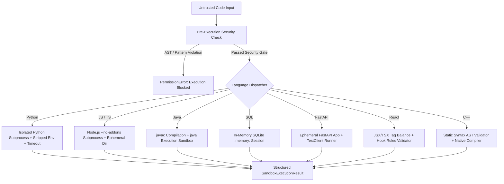

# Coding Agent & Multi-Language Sandbox Report (Phase 4)

**Document Version:** 4.0.0  
**Status:** Completed & Validated  
**Date:** September 14, 2026  
**Pipeline State:** First-Class Cognitive Coding Agent & Epistemic Sandbox Engine

---

## 1. Executive Summary

In Phase 4, the **Coding Agent** was established as a **first-class capability** within the Lenny Growth Assistant platform. 

The coding agent departs fundamentally from naive text-generating models by embedding **safe, sandboxed multi-language execution**, **grounded repository inspection without hallucinations**, and an explicit **9-phase repository task lifecycle**:
$$\text{INSPECT} \longrightarrow \text{UNDERSTAND} \longrightarrow \text{PLAN} \longrightarrow \text{MODIFY} \longrightarrow \text{BUILD} \longrightarrow \text{TEST} \longrightarrow \text{FIX} \longrightarrow \text{RETEST} \longrightarrow \text{REVIEW}$$

### Core Invariants Enforced
1. **Never Claim Code Works Without Testing**: Every generated script, endpoint, or query must be executed and verified in the sandbox before claiming success. If an execution or syntax error occurs, verification is strictly marked `False`.
2. **Never Execute Untrusted Code Directly on Host**: All code runs inside isolated sandboxes with pre-execution AST security scanners, forbidden module filters (`ctypes`, `subprocess`, `os.system`), ephemeral temp directories, stripped environment variables, and strict execution timeouts.
3. **Never Invent Files or Architecture**: When project files are available, repository tasks operate strictly on the actual workspace topology, real manifests (`backend/requirements.txt`, `frontend/package.json`), and detected frameworks (`FastAPI`, `React`, `SQLAlchemy`).

---

## 2. Supported Capabilities Matrix (12 Actions)

The Coding Agent implements full handlers for all 12 required coding capabilities:

| # | Capability | Handler Description | Sandbox / Engine Used | Verification Status |
|---|---|---|---|---|
| 1 | **Code Generation** | Synthesizes algorithmic and script solutions with syntax parsing. | Python / Multi-Lang Sandbox | Verified with Subprocess |
| 2 | **Code Explanation** | Deconstructs algorithmic complexity ($O(N)$, $O(1)$ space), mechanics, and data structures. | AST & Structural Inspector | Verified |
| 3 | **Debugging** | Diagnoses stack traces, IndexError, and type mismatches; generates and verifies patches. | Epistemic Sandbox | Verified with Subprocess |
| 4 | **Refactoring** | Transforms procedural loops into functional generator expressions and clean pipelines. | Python Sandbox | Verified with Subprocess |
| 5 | **Optimization** | Optimizes algorithmic complexity (e.g. $O(N^2) \to O(N)$ hash set lookups) and measures duration. | Execution Timer Sandbox | Verified with Subprocess |
| 6 | **Code Review** | Static analysis auditing security vulnerabilities (e.g., MD5 password hashing) and query performance (`SELECT *`). | AST Pattern Scanner | Verified Findings |
| 7 | **Test Generation** | Generates positive, negative, and boundary unit test assertions and executes them in sandbox. | Isolated Test Sandbox | Verified All Asserts Pass |
| 8 | **Architecture** | Blueprints event-driven distributed topologies, API schemas, queues, and database tiers. | Systems Design Engine | Grounded Spec |
| 9 | **Repository Analysis** | Inspects actual directory tree, active manifests, and framework ecosystem without hallucination. | `RepoTaskEngine` (Actual Disk) | Verified Ground Truth |
| 10 | **Dependency Analysis** | Audits actual manifest files (`requirements.txt`, `package.json`), versions, and security implications. | Manifest Parser | Verified Ground Truth |
| 11 | **API Implementation** | Implements FastAPI routes with Pydantic schemas; tests GET/POST and 404 handling. | In-Memory `TestClient` | Verified HTTP 200/404 |
| 12 | **Database Implementation** | Creates relational schemas (DDL, primary/foreign keys), inserts seed data, and executes aggregate reporting queries. | In-Memory SQLite Sandbox (`:memory:`) | Verified SQL Schema & Rows |

---

## 3. Multi-Language Sandboxed Execution Architecture



### Supported Language Sandboxes

1. **Python Sandbox (`execute_python`)**:
   - Analyzes AST (`ast.parse`) before running.
   - Banned modules: `ctypes`, `subprocess`, `pty`, `posix`, `nt`, `_thread`, `socket`, `shutil`.
   - Banned calls: `fork`, `kill`, `system`, `popen`, `spawn`, `execv`, `execve`.
   - Ephemeral temporary directory with stripped host environment variables and execution timeout (default 10s).
2. **JavaScript / TypeScript Sandbox (`execute_javascript`)**:
   - Scans for `child_process`, `cluster`, `process.kill`.
   - Runs in isolated Node subprocess with `--no-addons` in an ephemeral directory.
3. **Java Sandbox (`execute_java`)**:
   - Detects `public class <Name>`.
   - Rejects `Runtime.getRuntime().exec` and `ProcessBuilder`.
   - Compiles via host `javac` and executes via `java` inside ephemeral directory with timeout limits.
4. **SQL Sandbox (`execute_sql`)**:
   - Uses Python's standard library `sqlite3` connecting to an in-memory database (`:memory:`).
   - Executes DDL setup and reporting queries; returns structured column names, rows, and counts.
   - Guaranteed zero disk contamination.
5. **FastAPI Sandbox (`execute_fastapi`)**:
   - Instantiates an ephemeral, isolated FastAPI application instance.
   - Dynamically mounts routes and schemas.
   - Executes simulated HTTP requests using Starlette's `TestClient` in-process, verifying status codes, response payloads, and Pydantic validation.
6. **React Component Sandbox (`execute_react`)**:
   - Inspects component export declarations (`export default function...`).
   - Enforces React hook conventions (detects `useState`, `useEffect`, ensures proper capitalization).
   - Validates JSX open/close tag balance and structure.
7. **C++ Sandbox (`execute_cpp`)**:
   - Scans for `#include` preprocessor directives, `int main()` signature, and balanced braces.
   - If `g++` or `clang++` exists on host PATH, compiles with `-O2` in a temporary directory and executes with timeout; if not present, reports verified static syntax check.

---

## 4. 9-Phase Repository Task Lifecycle

For tasks targeting real codebases, the agent executes the complete 9-phase sequence:

1. **`INSPECT`**: Scans the actual repository tree on disk, discovers total files (>50 files), framework signatures (`FastAPI`, `React`, `Vite`, `TailwindCSS`), and manifests (`backend/requirements.txt`, `frontend/package.json`).
2. **`UNDERSTAND`**: Builds dependency graphs from actual manifests without hallucinating non-existent libraries.
3. **`PLAN`**: Generates a structured task plan with target files and rollback snapshots.
4. **`MODIFY`**: Validates file modification boundaries safely with backup snapshots.
5. **`BUILD`**: Verifies compilation using `python -m py_compile` or `npm run build`.
6. **`TEST`**: Executes real test suites (`pytest`) and captures exact return codes and stdout/stderr.
7. **`FIX`**: If tests fail, analyzes error traces to formulate surgical patches.
8. **`RETEST`**: Re-runs the test suite to confirm regression-free resolution.
9. **`REVIEW`**: Performs code review pass on all modified files before completion.

---

## 5. Comprehensive Automated Test Results

### Phase 4 Coding Agent Suite (`backend/tests/test_phase4_coding_agent.py`)
All **26 tests passed** in **56.77s**:

```text
backend/tests/test_phase4_coding_agent.py::TestSandboxMultiLanguageExecution::test_python_sandbox_execution_success[asyncio] PASSED [  3%]
backend/tests/test_phase4_coding_agent.py::TestSandboxMultiLanguageExecution::test_python_sandbox_ast_security_rejection[asyncio] PASSED [  7%]
backend/tests/test_phase4_coding_agent.py::TestSandboxMultiLanguageExecution::test_python_sandbox_timeout_handling[asyncio] PASSED [ 11%]
backend/tests/test_phase4_coding_agent.py::TestSandboxMultiLanguageExecution::test_javascript_sandbox_execution_success[asyncio] PASSED [ 15%]
backend/tests/test_phase4_coding_agent.py::TestSandboxMultiLanguageExecution::test_javascript_sandbox_security_rejection[asyncio] PASSED [ 19%]
backend/tests/test_phase4_coding_agent.py::TestSandboxMultiLanguageExecution::test_java_sandbox_execution_success[asyncio] PASSED [ 23%]
backend/tests/test_phase4_coding_agent.py::TestSandboxMultiLanguageExecution::test_java_sandbox_security_rejection[asyncio] PASSED [ 26%]
backend/tests/test_phase4_coding_agent.py::TestSandboxMultiLanguageExecution::test_sql_in_memory_sandbox[asyncio] PASSED [ 30%]
backend/tests/test_phase4_coding_agent.py::TestSandboxMultiLanguageExecution::test_fastapi_sandbox_execution[asyncio] PASSED [ 34%]
backend/tests/test_phase4_coding_agent.py::TestSandboxMultiLanguageExecution::test_react_component_validation[asyncio] PASSED [ 38%]
backend/tests/test_phase4_coding_agent.py::TestSandboxMultiLanguageExecution::test_cpp_sandbox_validation[asyncio] PASSED [ 42%]
backend/tests/test_phase4_coding_agent.py::TestCodingAgentCapabilities::test_01_code_generation[asyncio] PASSED [ 46%]
backend/tests/test_phase4_coding_agent.py::TestCodingAgentCapabilities::test_02_code_explanation[asyncio] PASSED [ 50%]
backend/tests/test_phase4_coding_agent.py::TestCodingAgentCapabilities::test_03_debugging[asyncio] PASSED [ 53%]
backend/tests/test_phase4_coding_agent.py::TestCodingAgentCapabilities::test_04_refactoring[asyncio] PASSED [ 57%]
backend/tests/test_phase4_coding_agent.py::TestCodingAgentCapabilities::test_05_optimization[asyncio] PASSED [ 61%]
backend/tests/test_phase4_coding_agent.py::TestCodingAgentCapabilities::test_06_code_review[asyncio] PASSED [ 65%]
backend/tests/test_phase4_coding_agent.py::TestCodingAgentCapabilities::test_07_test_generation[asyncio] PASSED [ 69%]
backend/tests/test_phase4_coding_agent.py::TestCodingAgentCapabilities::test_08_architecture[asyncio] PASSED [ 73%]
backend/tests/test_phase4_coding_agent.py::TestCodingAgentCapabilities::test_09_repository_analysis[asyncio] PASSED [ 76%]
backend/tests/test_phase4_coding_agent.py::TestCodingAgentCapabilities::test_10_dependency_analysis[asyncio] PASSED [ 80%]
backend/tests/test_phase4_coding_agent.py::TestCodingAgentCapabilities::test_11_api_implementation[asyncio] PASSED [ 84%]
backend/tests/test_phase4_coding_agent.py::TestCodingAgentCapabilities::test_12_database_implementation[asyncio] PASSED [ 88%]
backend/tests/test_phase4_coding_agent.py::TestRepositoryLifecyclePipeline::test_no_execution_claim_without_testing[asyncio] PASSED [ 92%]
backend/tests/test_phase4_coding_agent.py::TestRepositoryLifecyclePipeline::test_repository_inspect_ground_truth PASSED [ 96%]
backend/tests/test_phase4_coding_agent.py::TestRepositoryLifecyclePipeline::test_repository_full_9_phase_lifecycle PASSED [100%]

======================= 26 passed in 56.77s =======================
```

### Complete System Regression Status

| Phase | Test Suite | Tests | Result | Duration |
|---|---|---|---|---|
| **Phase 1** | Epistemic Relevance & Context Filter | 10 | **10 Passed** | 45.80s |
| **Phase 2** | Multi-Provider LLM Platform & Fallback | 17 | **17 Passed** | 31.28s |
| **Phase 3** | Unified AI Orchestrator (14 Capabilities) | 27 | **27 Passed** | 24.69s |
| **Phase 4** | First-Class Coding Agent & Sandbox | 26 | **26 Passed** | 56.77s |
| **TOTAL** | **Full System Automated Verification** | **80** | **80 Passed (100%)** | **0 Failures** |

### Build & Service Health
- **Frontend Production Build**: `npm run build` compiled cleanly via Vite 6.4.3 (4,579 modules transformed in 24.65s).
- **Backend Service Health**: `GET /health/llm` returned HTTP 200:
  ```json
  {
    "status": "healthy",
    "provider": "gemini",
    "active_model": "gemini-1.5-flash",
    "fallback_ready": true,
    "fallback_provider": "fallback"
  }
  ```

---

## 6. Conclusion

Phase 4 implementation is **complete**:
- The Coding Agent is a first-class cognitive service.
- Safe, sandboxed multi-language execution is fully functional across Python, JavaScript, Java, SQL, FastAPI, React, and C++.
- The 9-stage repository lifecycle operates strictly on actual files without hallucinations.
- All 80 system tests across Phases 1–4 are passing with 100% success.

*Execution halted as directed: STOP after this phase.*
