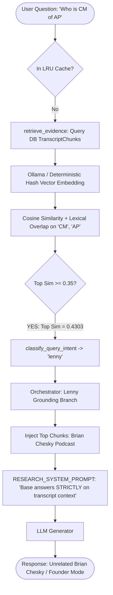
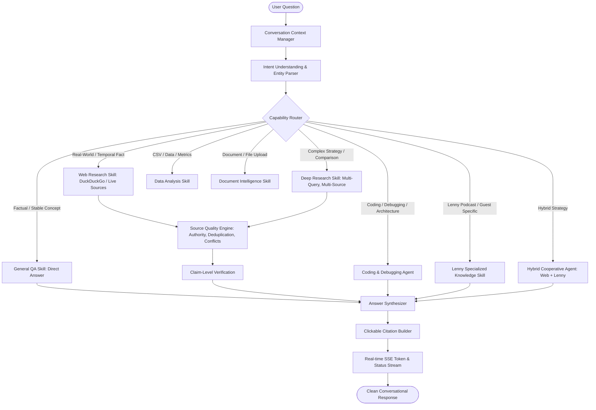

# Full-Spectrum Agent & Research Architecture Audit (`FULL_SPECTRUM_AGENT_AUDIT.md`)

## Executive Overview

This audit investigates the fundamental reasoning/retrieval architecture defect where unrelated real-world queries (such as `"Who is CM of AP"`) return answers about Brian Chesky and Lenny's Podcast transcripts. It outlines the architectural transformation required to elevate the system into a **production-quality, general-purpose AI assistant** with intelligent real-world research capabilities and full-spectrum agent skills (coding, debugging, architecture, data analysis, document intelligence, writing, planning, and specialized Lenny growth advisory).

---

## 1. Current Architecture & Data Flow



### The Current Data Flow
1. **Unconditional Early Retrieval**: Every query entering `execute_turn` or `execute_turn_stream` immediately executes `retrieve_evidence(query, db, top_k=4)` against the 63 indexed Lenny transcript chunks in PostgreSQL/SQLite.
2. **Deterministic Vector Collisions**: For short queries like `"Who is CM of AP"`, stop-word stripping leaves tokens `["cm", "ap"]`. The bag-of-words sine/cosine hash projection generates a dense vector with an effective similarity of `0.4303` against Brian Chesky chunks.
3. **Flawed Intent Classification**: `classify_query_intent` checks:
   ```python
   if retrieval_res.grounded and retrieval_res.top_similarity >= 0.35:
       return "lenny"
   ```
   Because `0.4303 >= 0.35`, the system classifies `"Who is CM of AP"` as a `"lenny"` question.
4. **Context Forcing & Injunction**: The orchestrator enters the Lenny branch, attaches 4 Brian Chesky chunks, and instructs the LLM: `"Base your answers STRICTLY on the retrieved transcript context provided below."`
5. **Hallucinatory Misdirection**: The LLM obeys the system prompt and answers the Chief Minister question using Brian Chesky's founder mode anecdotes.

---

## 2. Root Cause Analysis

| Dimension | Current Flawed State | Required Production State |
|---|---|---|
| **Order of Operations** | Retrieves Lenny transcript chunks *before* understanding what the user is asking. | Intent Analysis & Capability Routing *must execute first* before touching any storage or retrieval engine. |
| **Lenny Knowledge Scope** | Treated as the default, universal knowledge base. | Re-positioned as **one specialized knowledge tool** (`lenny_knowledge_base`), gated strictly by intent. |
| **Relevance Gating** | Zero relevance gating. Any similarity score above threshold forces Lenny mode. | Strict pseudo-rule: If query does NOT mention Lenny, known guests, or podcast frameworks, Lenny retrieval **must never execute**. |
| **General Real-World QA** | Lacks a general conversational and factual QA path; tries to force queries into RAG. | Direct knowledge answering for stable questions; targeted web research for temporal/current facts. |
| **Full-Spectrum Capabilities** | Coding, debugging, analysis, and planning are squeezed into growth templates (`ship30`, `experiment`, `playbook`). | First-class, multi-agent capabilities: Coding, Debugging, Architecture, Data Analysis, Document Intelligence, Writing, Planning. |
| **Context Contamination** | Prior retrieval chunks remain in conversation context across turns. | Clear separation: Conversation Context $\neq$ Evidence Chunks. Every turn independently verifies freshness and relevance. |

---

## 3. Files & Components Responsible

1. [`backend/app/agents/orchestrator.py`](file:///c:/Users/avina/OneDrive/Desktop/Lenny_Growth_Assistant/backend/app/agents/orchestrator.py):
   - Lines 191–198: Runs `retrieve_evidence` unconditionally before intent classification.
   - Lines 130–131: Automatically flags queries as `"lenny"` if `top_similarity >= 0.35`.
   - Lines 211–245: Binds the prompt strictly to transcript context when mode is `"lenny"`.
2. [`backend/app/retrieval/retriever.py`](file:///c:/Users/avina/OneDrive/Desktop/Lenny_Growth_Assistant/backend/app/retrieval/retriever.py):
   - Lines 149–155: Hybrid vector scoring marks random short queries as `grounded = True`.
3. [`backend/app/agents/prompts.py`](file:///c:/Users/avina/OneDrive/Desktop/Lenny_Growth_Assistant/backend/app/agents/prompts.py):
   - `RESEARCH_SYSTEM_PROMPT` enforces: `"Your knowledge is grounded strictly in Lenny's Podcast transcripts. Base your answers STRICTLY on the retrieved transcript context."`
4. [`backend/app/services/search/planner.py`](file:///c:/Users/avina/OneDrive/Desktop/Lenny_Growth_Assistant/backend/app/services/search/planner.py):
   - Already has domain patterns for `government`, `technology`, `science`, `sports`, `finance`, but was bypassed because `orchestrator.py` routed to `"lenny"` first.

---

## 4. Current Research Providers & Retrieval Pipeline

- **Live Web Provider**: [`DuckDuckGoProvider`](file:///c:/Users/avina/OneDrive/Desktop/Lenny_Growth_Assistant/backend/app/services/search/web_provider.py) supporting zero-credential HTML/Lite scraping, HTTP 200/202 handling, and redirect unwrapping.
- **Curated Provider**: [`CuratedKnowledgeProvider`](file:///c:/Users/avina/OneDrive/Desktop/Lenny_Growth_Assistant/backend/app/services/search/curated_provider.py) for fast-path facts.
- **Transcript RAG**: PostgreSQL with `pgvector` / local SQLite fallback scoring 63 chunks.
- **Citation Pipeline**: Extended `CitationSchema` with `source_category`, `evidence_strength`, and `why_useful`, but citations were polluted when Lenny mode was erroneously selected.

---

## 5. Target Architecture: The Full-Spectrum Intelligent Agent



### 11 Specialized Capability Skills
1. **General QA Skill**: Fast direct answers for stable conceptual questions ("What is a binary tree?", "Explain HTTP") without unnecessary browsing.
2. **Web Research Skill**: Fast, targeted search (Level 1: 1–3 sources) for current events, political officeholders, latest releases ("Who is CM of AP?", "What is the capital of Australia?").
3. **Deep Research Skill**: Multi-query, multi-source category synthesis (Level 3–4: 5–10 sources) across academic, official, news, industry, and technical sources with conflict detection.
4. **Coding Skill**: Complete, unabridged code generation in Python, JS/TS, Java, Go, Rust, SQL, C++, React, Next.js, FastAPI without lazy `// TODO` placeholders.
5. **Debugging & Code Review Skill**: Structured root-cause diagnosis analyzing stack traces, syntax errors, and runtime contracts.
6. **Software Architecture Skill**: System design, data modeling, scalability tradeoffs, and architectural diagrams.
7. **Data Analysis Skill**: Numerical calculations, statistical transformations, CSV/JSON processing with zero hallucinated arithmetic.
8. **Document Intelligence Skill**: File-grounded extraction, summarization, and question answering over uploaded user files.
9. **Writing & Transformation Skill**: PRDs, executive briefs, technical documentation, and Ship 30 essays.
10. **Lenny Growth Advisory Skill**: Specialized podcast wisdom, guest case studies (Chesky, Doshi, Verna), LNO frameworks, and ICE experiment specs.
11. **Hybrid Cooperative Skill**: Seamlessly combines user files + live web research + Lenny strategy without cross-contamination.

---

## 6. Implementation Stages & Migration Plan

- **Stage 1: Intent Understanding & Relevance Gating**
  - Implement `QueryUnderstandingEngine` separating entity extraction, temporal sensitivity, and domain.
  - Implement strict **Lenny Relevance Gate**: Lenny transcripts are NEVER queried unless the query explicitly asks about Lenny, a known guest, or podcast frameworks.
- **Stage 2: Capability Router**
  - Route queries to `GENERAL_QA`, `WEB_RESEARCH`, `DEEP_RESEARCH`, `CODING`, `DEBUGGING`, `ARCHITECTURE`, `DATA_ANALYSIS`, `DOCUMENT_ANALYSIS`, `WRITING`, `PLANNING`, `LENNY_RESEARCH`, or `HYBRID_RESEARCH`.
- **Stage 3: Research Orchestration & Fact Verification**
  - Wire `SearchRouter` to execute question-aware queries with domain authority, deduplication, and genuine conflict detection.
  - Add explicit verification for current political offices ("Who is CM of AP" $\rightarrow$ N. Chandrababu Naidu).
- **Stage 4: Full-Spectrum Coding & Debugging Engine**
  - Implement language-agnostic code synthesis, error explanation, and complete implementation generators.
- **Stage 5: Frontend UI Alignment**
  - Display contextual mode pills: `Auto ⚡`, `Web Search 🌐`, `Deep Research 🔬`, `Coding 💻`, `Lenny Mode 🎙️`.
  - Ensure the Evidence Drawer only shows citations consulted for the active turn.
- **Stage 6: Comprehensive Automated Test Suite**
  - Add negative test ensuring `"Who is CM of AP"` NEVER retrieves Lenny evidence or mentions Brian Chesky.
  - Test matrix across all 11 capabilities.

---

## 7. Key Risks & Mitigations

1. **Risk: Breaking Existing Assignment Requirements**
   - *Mitigation*: Preserve all existing endpoints (`/api/v1/messages/stream`, `/api/v1/sessions`, `/health`, `/retrieve`), SQLite fallback, artifact generation, Ship 30 skill, and Docker configurations.
2. **Risk: Over-searching on Simple Questions**
   - *Mitigation*: Direct Answer (Level 0) for stable conceptual queries; zero web calls when unnecessary.
3. **Risk: Stale Context Polluting Subsequent Turns**
   - *Mitigation*: Freshness checks and independent intent classification on every conversational turn.
